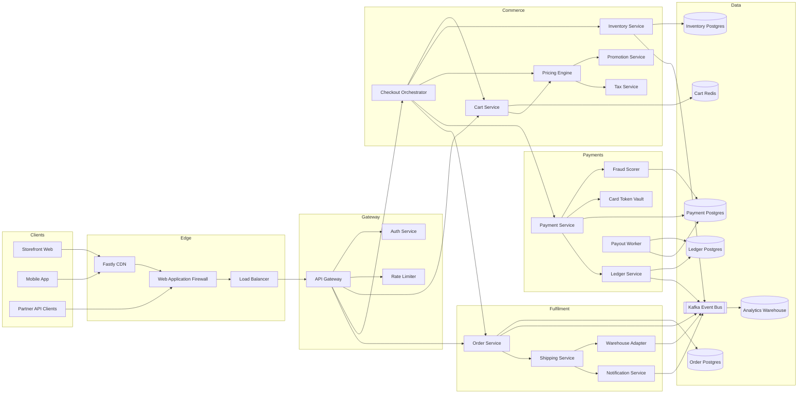
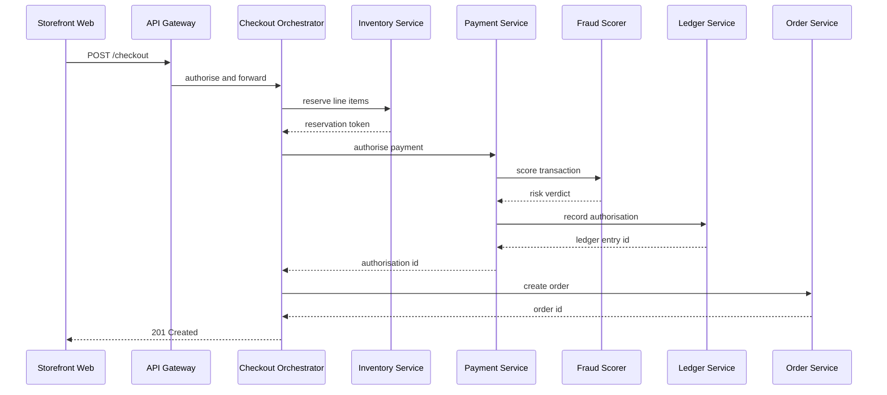
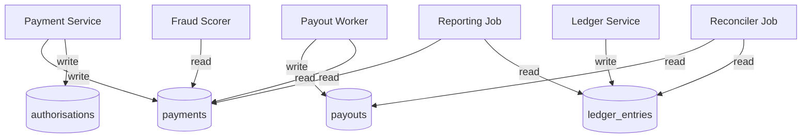
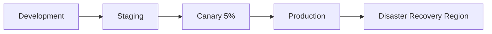

# Mermaid Atlas

Mermaid Atlas is a browser-based visual workspace for exploring and improving large Mermaid diagrams. A human can render, search, navigate, and edit a diagram while an AI agent uses ten WebMCP tools to query the same live graph, trace dependencies, identify structural issues, create guided walkthroughs, and make parser-validated changes with guarded undo.

Built for the [OpenAI WebMCP Challenge](https://openai.com/webmcp-challenge/), Atlas turns architecture documentation into a bounded graph interface where people and agents can reason together on the same live canvas without loading the entire diagram into the model’s context. Atlas has no application backend; diagram rendering and workspace storage happen locally in the browser.

## Links

- **Live app:** [mermaid-atlas.vercel.app](https://mermaid-atlas.vercel.app)
- **Source code:** [github.com/sauranshbhavya/mermaid-atlas](https://github.com/sauranshbhavya/mermaid-atlas)
- **License:** [MIT](LICENSE)

## What it does

- Renders raw Mermaid source or Markdown containing multiple fenced Mermaid diagrams.
- Imports local `.mmd`, `.mermaid`, `.md`, `.markdown`, and `.txt` files.
- Builds a searchable Graph Index with grouping, sorting, source-line mapping, and relationship counts.
- Supports keyboard navigation, node inspection, relationship highlighting, pan, zoom, and persisted light and dark themes.
- Gives agents bounded tools for diagram discovery, graph search, dependency inspection, path tracing, structural analysis, walkthrough creation, source editing, and undo.
- Reflects agent activity visibly on the same canvas the human is using.
- Stores imported diagrams and workspace state locally in the browser without requiring an account.

## Why WebMCP

A large-diagram viewer helps a person navigate architecture, but WebMCP turns that viewer into a workspace where a person and an AI agent can investigate the system together.

Without WebMCP, an agent would need to interpret the visual interface or ingest the entire Mermaid document into its context. Mermaid Atlas instead exposes the active diagram through structured, purpose-built tools. An agent can resolve natural-language component names to stable node IDs, inspect dependencies, calculate blast radius, trace routes, identify structural issues, and locate the exact source lines involved.

The interaction remains visible to the person using the application. Agent queries can select nodes on the shared canvas, traced routes can become human-paced walkthroughs, and requested edits are parser-validated, recorded in the activity history, and protected by conflict-aware undo.

WebMCP is therefore not an additional control layer placed on top of Atlas—it connects the agent directly to the same graph model, source, selection, and canvas state that the human is already using.

## Try it

Open [Mermaid Atlas](https://mermaid-atlas.vercel.app) in ChatGPT’s in-app browser, or in Chrome 149 or later with WebMCP enabled. The bundled Northwind architecture is ready immediately, with no account, setup, or file upload required.

Try asking:

- “Find Payment Service and show what depends on it within two hops.”
- “Trace the shortest path from API Gateway to Payment Postgres and create a guided walkthrough.”

## WebMCP tools

Atlas registers ten tools on `document.modelContext`:

| Tool | What the agent can do | How it helps the human |
| --- | --- | --- |
| `get_atlas_guide` | Read app-authored workflows, call ordering, safety guidance, and example tasks. | Gives an unfamiliar agent an operating guide without relying on unsupported WebMCP prompt primitives. |
| `list_diagrams` | Page through bounded metadata for bundled and imported diagrams. | Establishes which architectural views are available and which one is active. |
| `open_diagram` | Render a selected library diagram and make it the active graph. | Brings the exact architectural view under discussion onto the shared canvas. |
| `search_graph` | Resolve a name, ID, or group fragment to ranked, stable node IDs. | Connects language such as “payment service” to an exact visual node and source location. |
| `get_neighborhood` | Walk incoming dependencies, outgoing dependencies, or both for up to six hops. | Explains local context and blast radius without overwhelming the human with the entire graph. |
| `trace_path` | Find up to five shortest-first routes between two nodes. | Turns questions such as “How does this request reach that database?” into concrete chains of responsibility. |
| `create_walkthrough` | Create a narrated tour containing up to 24 nodes. | Converts a graph result into a human-paced onboarding or incident-explanation experience. |
| `apply_patch` | Apply line-targeted insert, replace, delete, or exact-text operations after Mermaid validation. | Lets the agent repair or clarify source while keeping the resulting change visible and inspectable. |
| `undo_last_change` | Revert the latest agent patch when the active diagram and source revision still match. | Gives the human a safe escape hatch without overwriting later manual edits. |
| `analyze_structure` | Report bounded cycles, orphans, entry points, and dead ends. | Surfaces structural risks that are difficult to identify by scanning a large canvas. |

Every tool returns structured WebMCP data alongside a compatible text result. Explicit success and error states help agents recover from ambiguous node names, stale rendered state, invalid source, conflicting edits, and bounded-query limits.

Atlas treats the graph as a retrieval interface rather than a document pipe:

- `list_diagrams` defaults to eight entries and caps each page at twenty.
- `search_graph` caps results at fifty and reports `total` and `truncated`.
- `get_neighborhood` is bounded by both depth and a fifty-node budget.
- `trace_path` returns at most five paths and caps its exploration queue at 20,000 entries.
- Node IDs come from Mermaid source rather than SVG layout, so they remain stable across renders and ELK layout changes.
- Graph results include Mermaid `sourceLine` values wherever the diagram syntax provides a stable source location.
- Imported headings and rendered labels are identified as untrusted content in WebMCP annotations.

Read-only annotations reflect observable behavior. For example, `get_neighborhood` selects its root on the canvas, so it is not advertised as read-only even though it does not modify Mermaid source.

## Human control and safety

- The canvas footer displays the latest agent action. The **Agent activity** dialog retains the 40 most recent activity entries with status, inputs, summaries, and duration.
- The agent can author a walkthrough, but only the human advances it using Back, Next, the progress controls, or the arrow keys.
- Every patch is parsed by Mermaid before it is committed. Invalid syntax leaves the source unchanged and returns a focused parser error.
- Line operations reject missing, negative, out-of-range, or ambiguously duplicated targets.
- Exact-text replacement rejects empty searches and text that is not present.
- If the source changes while a patch is being validated, Atlas abandons the patch instead of overwriting the newer version.
- Undo history is scoped to the active diagram and expected source revision. It cannot cross diagrams or overwrite later human edits.
- Switching diagrams refuses to discard unrendered editor changes unless the agent has explicit authorization.
- Imported headings and rendered labels are marked as untrusted content in the WebMCP tool annotations.
- Atlas has no application backend. Imported diagrams and saved workspace entries are stored locally in the browser.

## How it works

```text
Mermaid or Markdown source
          |
          v
renderer-specific semantic adapters -----> stable nodes, edges, groups, source lines
          |                                                |
          v                                                v
human canvas, index, selection                 bounded WebMCP graph tools
          ^                                                |
          +----------- shared active graph and state ------+
```

`src/mermaid/diagram-adapters.js` separates source identity, renderer identity, and display labels. This allows WebMCP results, visual selections, and source edits to refer to the same stable components even when Mermaid generates different SVG structures for different diagram families.

Selection styling is applied to adapter-owned visual elements rather than broad descendant SVG shapes. This prevents interactions from distorting class aggregation diamonds or highlighting architecture icons as though they were service boundaries.

The `atlasApi` object in `src/viewer/controller.js` is the single integration seam between the visual workbench and the WebMCP layer. Tool handlers do not manipulate internal viewer state or DOM elements directly.

The application registers its WebMCP tools before the document-ready boundary completes so an external client can discover the full tool surface when the page first becomes available. Browsers without native WebMCP support lazily load `@mcp-b/global` as a compatibility layer.

## Diagram support

The production menu contains the featured Northwind service topology plus focused flowchart, sequence, class, state, entity-relationship, mindmap, and architecture examples.

Broader compatibility coverage lives in the development-only renderer laboratory, which exercises 46 Mermaid fixtures across relationship diagrams, ordered-item diagrams, chart families, experimental syntaxes, and ELK layout modes.

Chart-oriented families retain rendering, panning, and zooming without pretending that axes, slices, data points, or other visual marks are graph nodes.

Mermaid is configured with `maxEdges: 20,000`, `maxTextSize: 5,000,000`, strict security mode, and the ELK flowchart renderer. `@mermaid-js/layout-elk` remains a deliberate dependency for laying out large graphs.

## Run locally

### Prerequisites

- Node.js `20.19+` or `22.12+`
- npm

```sh
git clone https://github.com/sauranshbhavya/mermaid-atlas.git
cd mermaid-atlas
npm ci
npm run dev
```

Open the URL printed by Vite. You can paste raw Mermaid source, paste Markdown containing one or more fenced `mermaid` blocks, use **Open file**, or load one of the bundled examples.

Markdown imports retain a block picker and expose the selected Mermaid source in the editor.

For native WebMCP, use the ChatGPT in-app browser or Chrome 149 or later:

1. Open `chrome://flags/#enable-webmcp-testing`.
2. Enable the WebMCP testing flag.
3. Restart Chrome.
4. Open Mermaid Atlas.

The `/debug` renderer laboratory is available only during `npm run dev`. Production builds redirect `/debug` to `/` and exclude the development fixture catalogue.

## Controls

- Drag the canvas background to pan.
- In trackpad mode, use two-finger scrolling to pan and pinch to zoom.
- In mouse mode, use the mouse wheel to zoom around the pointer.
- Select a node to highlight its direct incoming and outgoing relationships.
- Use the Graph Index to search, sort, group, select, center, and zoom to a node.
- Use `←` and `→` to browse incoming and outgoing relationships.
- Use `↑` and `↓` to preview relationship alternatives.
- Press `S` or `Enter` to select the previewed node.
- Press `Z` to zoom to the selected node and `Escape` to cancel or clear the selection.
- Press `/` to focus graph search.
- Press `Cmd+Enter` or `Ctrl+Enter` to render editor changes.
- Use the Controls dialog to adjust pan, zoom, and pointer-device sensitivity.
- Use the toolbar theme switch for the persisted light or dark appearance.

## Verification

```sh
npm test
npm run test:e2e
npm run test:webmcp
npm run test:production
```

- `npm test` covers diagram catalogue IDs, adapter declarations, source-line semantics, Markdown imports, bounded graph queries, dense-path saturation, patch safety, and renderer contracts.
- `npm run test:e2e` renders the featured workspace, all seven public examples, and all 46 development fixtures. It verifies selection, navigation, themes, responsive layout, source highlighting, large-diagram interaction, and sequence, state, class, and architecture behavior.
- `npm run test:webmcp` exercises all ten tools through the real `document.modelContext` API. It verifies first-run discovery, graph retrieval, diagram switching, structured results, tool annotations, walkthroughs, guarded patching, conflict handling, undo, and visible activity history.
- `npm run test:production` builds the application, confirms that `/debug` redirects to `/`, and checks that development-only fixtures are absent from the production JavaScript.

## Known limitations

- Workspace data is currently local to each browser. Account-based synchronization and multi-user collaboration are not available in the current version.
- Chart-oriented diagram families retain rendering, panning, and zooming without exposing their individual visual marks as graph nodes.
- Broad Mermaid compatibility produces several large optional renderer chunks. Atlas retains this compatibility deliberately while ensuring development-only fixtures remain outside the production bundle.
- WebMCP remains experimental and requires the ChatGPT in-app browser or a compatible version of Chrome with WebMCP enabled.

## Project structure

- `src/viewer/` — visual workbench, graph interaction, navigation, and the `atlasApi` integration seam.
- `src/webmcp/` — tool definitions, bounded graph queries, diagram library, registration, and activity history.
- `src/walkthrough/` — agent-authored, human-controlled narrated tours.
- `src/demo/` — extraction of the bundled first-run workspace.
- `src/mermaid/` — Mermaid and ELK configuration plus semantic and visual adapters.
- `src/fixtures/` — focused production examples and the development compatibility catalogue.
- `src/debug/` — development-only renderer laboratory.
- `tests/unit/` — catalogue, adapter, library, graph-query, and patch contracts.
- `scripts/` — browser interaction, WebMCP, build, and production-isolation verification.

## Bundled demo workspace

Atlas seeds its first-run workspace from the four diagrams below. The same workspace is exercised by the browser and WebMCP verification suites.

<!-- challenge-demo:start -->
### Northwind Commerce — Platform Architecture

Reference architecture for the Northwind storefront. Every service boundary, queue, and datastore that a checkout request can touch is catalogued here so new engineers can trace a request end to end without reading the whole repository.

#### Service Topology

The full request-serving surface. Edge traffic terminates at the CDN, is routed by the API gateway, and fans out into the domain services.



#### Checkout Request Flow

The happy path for `POST /checkout`. Payment authorisation is synchronous; fulfilment is driven by events published after the order is durable.



#### Payment Data Ownership

Which service is allowed to write which payment table. Only the Payment Service and Payout Worker hold write credentials for `payments`.



#### Deployment Environments


<!-- challenge-demo:end -->

## Team

Mermaid Atlas was built by co-founders **Sauransh Bhardwaj** and **Bhavya Singh** for the OpenAI WebMCP Challenge.

## License

MIT — see [LICENSE](LICENSE).
