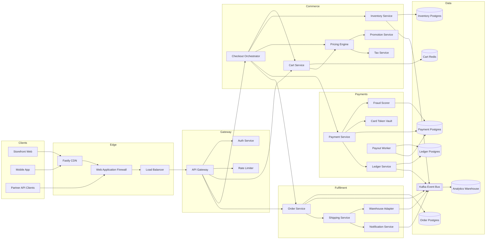
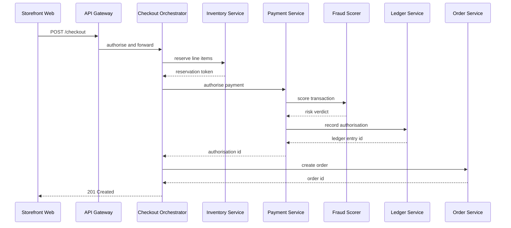
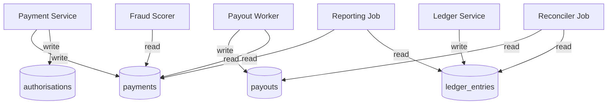
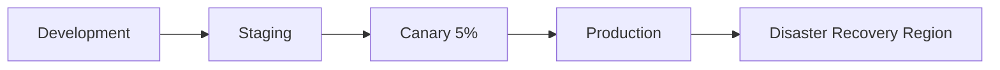

# Mermaid Atlas

Mermaid Atlas is a shared visual workspace for large Mermaid diagrams. A human can render, search, navigate,
and edit a software map while an AI agent uses ten WebMCP tools to inspect the same live graph, explain it
as a guided walkthrough, and safely improve the source.

The product is built for a common codebase problem: architecture knowledge exists, but it is scattered across
files, diagrams, and individual engineers. Atlas turns that knowledge into a bounded graph interface that an
agent can query without sending an entire 20,000-edge document into its context.

## Submission links

| Submission item | Link |
| --- | --- |
| Live application | **TODO — add the public deployment URL** |
| Public repository | **TODO — add the public repository URL** |
| Demo video | **TODO — add the public YouTube URL** |
| License | [MIT](LICENSE) |

Nothing is submitted to Devpost from this repository. Before submission, verify the current dates and
requirements against the [official challenge rules](https://webmcp.devpost.com/rules) and replace every
placeholder above.

## Why it matters

Large diagrams are useful to people but awkward for models: passing the whole source is expensive, visually
rendered labels can be ambiguous, and an unbounded traversal can explode on dense graphs. Atlas gives the agent
small, purpose-built retrieval calls with stable source identities and gives the human a visual, reversible way
to inspect the answer.

The challenge story is deliberately focused:

- The browser and agent share one active architecture graph.
- The agent can discover diagrams, resolve human language to stable node IDs, inspect dependencies, trace routes,
  find structural issues, and narrate the result.
- Every node result includes its Mermaid `sourceLine`, allowing precise changes without reading the full document.
- Walkthroughs are authored by the agent but paced by the human.
- Patches are parser-validated, conflict-aware, visible in the activity history, and reversible per diagram.

On first load, Atlas opens the bundled **Northwind checkout architecture**: a 31-node service topology plus
three supporting diagrams. A judge can query it immediately without locating or uploading a fixture.

## WebMCP tool surface

Atlas registers these tools on `document.modelContext`:

| Tool | What the agent can do | How it helps a human understand the system |
| --- | --- | --- |
| `get_atlas_guide` | Read app-authored workflows, call ordering, safety guidance, and example tasks. | Gives an unfamiliar agent a concise operating manual without relying on unsupported WebMCP prompt primitives. |
| `list_diagrams` | Page through bounded metadata for bundled and imported diagrams. | Establishes what architectural views exist before choosing the relevant one. |
| `open_diagram` | Render a selected library diagram and make it the active graph. | Brings the exact view under discussion onto the shared canvas. |
| `search_graph` | Resolve a name, ID, or group fragment to ranked stable node IDs. | Connects language such as “payment service” to an exact visual and source location. |
| `get_neighborhood` | Walk incoming dependencies, outgoing dependencies, or both for up to six hops. | Explains local context and blast radius without overwhelming the person with the whole graph. |
| `trace_path` | Find up to five shortest-first routes between two nodes. | Turns “how does this request reach that database?” into a concrete chain of responsibility. |
| `create_walkthrough` | Create a narrated tour of up to 24 nodes. | Converts a graph answer into a human-paced onboarding or incident-explanation experience. |
| `apply_patch` | Apply line-targeted insert, replace, delete, or exact-text operations after Mermaid validation. | Lets the agent repair or clarify the source while keeping the proposed change inspectable. |
| `undo_last_change` | Revert the latest agent patch for the active diagram when its revision still matches. | Gives the human a safe escape hatch and prevents undo from overwriting later manual work. |
| `analyze_structure` | Report bounded cycles, orphans, entry points, and dead ends. | Surfaces maintainability risks that are difficult to spot by scanning a large canvas. |

This is a graph retrieval layer, not a document pipe:

- `list_diagrams` defaults to eight entries and caps a page at twenty.
- `search_graph` caps results at fifty and reports `total` and `truncated`.
- `get_neighborhood` is bounded by both depth and a fifty-node budget.
- `trace_path` caps returned paths and stops its queue at 20,000 entries, reporting `complete: false` if saturated.
- Node IDs come from Mermaid source rather than SVG layout, so they remain stable across renders and ELK changes.
- Imported headings and rendered labels are marked as untrusted content in WebMCP annotations.

Read-only annotations reflect observable behavior. For example, `get_neighborhood` selects its root on the
canvas, so it is not advertised as read-only even though it does not edit source.

## Human control and safety

- The latest agent command appears in the canvas footer. Selecting it opens the complete **Agent activity**
  dialog with call status and summaries.
- The agent can create a walkthrough, but only the human advances it using Back/Next, progress controls, or the
  arrow keys.
- A patch is parsed by Mermaid before commit. Invalid syntax changes nothing and returns a compact parser error.
- Line operations reject missing or negative indexes, out-of-range lines, and ambiguous duplicate targets.
- Exact-text replacement rejects empty searches and missing text.
- If the editor changes while asynchronous validation is running, the patch is abandoned.
- Undo history stores the diagram identity, before-source, and expected agent-produced revision. It will not
  cross diagrams or overwrite newer human edits.

## How it works

```text
Mermaid or Markdown source
          |
          v
renderer-specific semantic adapters -----> stable nodes, edges, groups, source lines
          |                                                |
          v                                                v
human canvas, index, selection                 bounded WebMCP graph tools
          ^                                                |
          +----------- shared active graph and state ------+
```

`src/mermaid/diagram-adapters.js` separates source identity, renderer identity, and display labels. Selection
styling is applied to adapter-owned paint parts instead of broad descendant SVG shapes, which avoids distorting
class aggregation diamonds or highlighting architecture logos as if they were node borders. Source membership
is preferred over DOM ancestry, and geometry is only used when the match is unique and covered by tests.

The production menu stays focused on the featured checkout topology plus flowchart, sequence, class, state, ER,
mindmap, and architecture examples. Broader compatibility coverage lives in the development-only renderer
laboratory. Canvas-only chart families deliberately keep render, pan, and zoom without pretending that axes,
slices, or marks are graph nodes.

## Run locally

```sh
npm install
npm run dev
```

Open the URL printed by Vite. Paste raw Mermaid, paste Markdown containing one or more fenced `mermaid` blocks,
or use **Open file**. Markdown imports retain a block picker and expose the selected Mermaid source in the editor.

Native WebMCP requires Chrome 149 or later with `chrome://flags/#enable-webmcp-testing` enabled, or the ChatGPT
in-app browser. In other browsers, Atlas lazily loads `@mcp-b/global` as a compatibility layer; native-capable
browsers do not download that fallback.

The `/debug` renderer laboratory exists only during `npm run dev`. Production builds redirect `/debug` to `/`
and exclude the development fixture catalogue.

## Controls

- Drag the canvas to pan and scroll over it to zoom around the pointer.
- Select a node to highlight its direct relationships; choose a neighbor to move focus.
- Use the Graph Index to select, center, and zoom to a node, or group entries by Mermaid subgraph.
- Use `←` and `→` for incoming/outgoing navigation, `↑` and `↓` to preview alternatives, `S` or `Enter` to
  commit the preview, `Z` to zoom, and `Escape` to cancel.
- Press `/` to search and `Cmd+Enter` or `Ctrl+Enter` to render editor changes.
- Use the toolbar theme switch for the persisted light or dark appearance.

Mermaid is configured with `maxEdges: 20000`, `maxTextSize: 5000000`, and the ELK flowchart renderer.
`@mermaid-js/layout-elk` remains a deliberate dependency for large graph layout.

## Verification

```sh
npm test
npm run test:e2e
npm run test:webmcp
npm run test:production
```

- `npm test` covers catalogue IDs, adapter declarations, source-line semantics, the Markdown library, bounded
  graph queries, dense-path saturation, patch safety, and renderer contracts.
- `npm run test:e2e` renders the featured demo, seven public examples, and all development fixtures, then checks
  selection, navigation, themes, responsive layout, and corrected sequence, state, class, and architecture behavior.
- `npm run test:webmcp` drives all ten tools through the real `document.modelContext` API. It imports this README,
  emulates graph-retrieval and diagram-family agent calls, steps a walkthrough with real input, and verifies that
  rejected or conflicted patches leave source untouched.
- `npm run test:production` builds the app, verifies the production `/debug` redirect, and scans emitted JavaScript
  for representative development-only fixture content.

Fresh cleanup verification on 30 August 2026 passed 33 unit/contract checks, 31 WebMCP browser checks, all eight
public/demo entries, and all 46 development fixtures. The production check also confirmed that `/debug` redirects,
no debug fixture renders, and no checked debug-only marker appears in the 122 emitted JavaScript assets. Re-run
the commands above after the final commit and use that output as the submission evidence.

## Devpost-ready submission copy

### Title

Mermaid Atlas

### Tagline

A shared visual architecture workspace where humans explore and AI agents query, explain, and safely improve
large Mermaid graphs through WebMCP.

### Description

Software architecture diagrams are valuable until they become too large to navigate or too expensive to place
inside an agent's context. Mermaid Atlas turns a live Mermaid canvas into a bounded WebMCP graph interface. An
agent can find services, inspect dependencies and blast radius, trace request paths, identify structural risks,
and turn results into narrated walkthroughs that the human controls. When the diagram needs correction, the
agent can make source-linked, parser-validated edits with conflict-aware undo. Humans see the same selection,
camera movement, walkthrough, and activity history, so the agent's reasoning becomes an inspectable visual
artifact rather than a detached text answer.

### What is technically distinctive

- Ten tools operate on the same active graph and canvas as the human, including an app-authored usage guide.
- Stable source IDs and line mappings connect visual nodes, tool results, and precise edits.
- Bounded search and traversal make large graphs model-friendly and explicitly report truncation.
- Renderer-specific adapters preserve graph semantics across Mermaid SVG implementations.
- Human-paced walkthroughs, visible activity, parser validation, and revision-scoped undo provide a practical
  control and trust model.

### Recommended three-minute demo

1. Open the deployed app and point out that the Northwind topology is already live.
2. Ask: “Find the payment service and show what depends on it within two hops.”
3. Ask: “Trace the shortest path from API Gateway to Payment Postgres.”
4. Ask the agent to create a walkthrough from that path, then advance it manually.
5. Ask the agent to add a clearly named risk/archive node, show the validated result, and undo it.
6. Open **Agent activity** and briefly explain bounded retrieval, untrusted-content annotations, and guarded undo.

### Screenshot plan

Capture these from the deployed build at a consistent desktop viewport:

1. Northwind topology on first load with the Graph Index visible.
2. Payment Service selected with incoming and outgoing relationships highlighted.
3. A live checkout-to-payment walkthrough with its thin progress indicator.
4. The Agent activity dialog showing successful retrieval, walkthrough, patch, and undo calls.
5. One focused dark-mode architecture example showing a visible cloud boundary.

## Prior-work disclosure

The repository history identifies one commit before the recorded challenge submission period and all later work.
Use `git diff b896ad3 HEAD` as the reproducible comparison before submitting. Every rewritten commit has a
descriptive subject and a detailed body that records its product, architecture, dependency, documentation, and
verification changes.

| Commit | Date | Classification |
| --- | --- | --- |
| `b896ad3` feat: create the large-diagram Mermaid workbench | 2026-08-23 22:57 +0100 | **Prior work** |
| `49214d6` refactor(ui): migrate the viewer shell to React 19 | 2026-08-26 23:38 +0100 | Submission-period work |
| `b3be0fb` feat(viewer): add graph indexing, keyboard traversal, and themes | 2026-08-27 01:09 +0100 | Submission-period work |
| `b5dc41c` merge: integrate the React viewer and navigation overhaul | 2026-08-27 01:12 +0100 | Submission-period work |
| `8d8a30e` feat: support the Mermaid catalog with semantic adapters and fixtures | 2026-08-27 21:12 +0100 | Submission-period work |
| `127632c` merge: integrate the multi-diagram adapter and fixture framework | 2026-08-27 21:13 +0100 | Submission-period work |
| `dc756a5` refactor(viewer): make diagram adapters own interaction extraction | 2026-08-28 18:44 +0100 | Submission-period work |
| `9730666` feat(webmcp): expose graph analysis and editing tools to agents | 2026-08-28 17:06 -0400 | Submission-period work |
| `022ef80` fix(viewer): align graph semantics, edge markers, and theme rendering | 2026-08-29 00:28 +0100 | Submission-period work |
| `HEAD` feat(webmcp): ship a self-contained demo and harden agent workflows | 2026-08-30 22:46 +0100 | Submission-period work |

The initial commit was a vanilla, single-file Mermaid pan/zoom prototype. It had no React application, WebMCP,
diagram library, semantic adapter layer, Graph Index, walkthroughs, source-linked patches, or agent activity UI.

Submission-period work includes the React workbench; `src/webmcp/`; the bundled first-run workspace; semantic
graph adapters; the `atlasApi` integration seam; agent-authored walkthroughs; patch history; the activity UI;
focused public examples; a development-only compatibility laboratory; and unit, browser, WebMCP, and production
isolation tests. The final commit consolidates the public demo and submission narrative, hardens the agent tool
surface, and verifies that development-only fixtures remain outside the production bundle.

### How Codex was used

Codex was used as an implementation and review collaborator: it audited the repository against the challenge
story, reproduced interaction problems in the browser, narrowed the public examples, hardened bounded graph
queries and patch/undo safety, removed unused ZenUML and tidy-tree packages, refined the agent activity and
walkthrough UI, and added unit, browser, production-isolation, and real WebMCP regression scenarios. Final product
decisions and the public submission remain the entrant's responsibility.

## Submission readiness

Implemented in the repository:

- [x] ~~Ten WebMCP tools with input schemas, titles, trust/read-only annotations, and an app-authored agent guide.~~
- [x] ~~Bundled first-run workspace with four immediately queryable diagrams.~~
- [x] ~~Bounded diagram listing, search, neighborhood traversal, and dense path search.~~
- [x] ~~Human-driven walkthroughs with theme persistence and footer-safe controls.~~
- [x] ~~Visible latest agent action and complete Agent activity dialog.~~
- [x] ~~Validated, conflict-aware, diagram-scoped patch and undo behavior.~~
- [x] ~~Focused public examples and development-only renderer coverage.~~
- [x] ~~Corrected sequence/state indexing, class diamond selection, and architecture boundary highlighting.~~
- [x] ~~Unused ZenUML and tidy-tree packages removed; ELK and the lazy WebMCP fallback retained deliberately.~~
- [x] ~~MIT license and automated unit, browser, WebMCP, build, and production-isolation checks.~~

Requires the entrant or an external account:

- [ ] Commit and push the final working tree to a public repository.
- [ ] Deploy a public URL and test it in the ChatGPT in-app browser and native WebMCP Chrome.
- [ ] Record a public demo under three minutes with clear audio and no unlicensed material.
- [ ] Replace the repository, live-app, and video placeholders at the top of this README.
- [ ] Add the final description, testing instructions, screenshots, links, and prior-work disclosure to Devpost.
- [ ] Confirm GitHub visibly detects the MIT license and the deployment remains available for judging.
- [ ] Re-check the official deadline and all eligibility/submission requirements immediately before submitting.

## Known limitation and post-submission follow-up

Mermaid still emits several dynamically loaded renderer chunks above 500 kB. ZenUML removal eliminated the
largest unused optional chunk, but replacing Mermaid's broad registry with a curated core would trade import
compatibility for bundle size. Profile the deployed first-load path before making that tradeoff; it is a measured
post-submission optimization, not a reason to weaken diagram support immediately before judging.

## Project structure

- `src/viewer/` — production workbench, interactions, and the `atlasApi` seam used by tools.
- `src/webmcp/` — tool definitions, bounded graph queries, diagram library, registration, and activity log.
- `src/walkthrough/` — agent-authored, human-driven narrated tours.
- `src/demo/` — extraction of the bundled demo section below.
- `src/mermaid/` — Mermaid/ELK configuration and semantic/visual adapters.
- `src/fixtures/` — focused public examples and the development-only compatibility catalogue.
- `src/debug/` — development-only renderer laboratory.
- `tests/unit/` — fast catalogue, adapter, library, graph-query, and patch contracts.
- `scripts/` — browser interaction, WebMCP, build, and production-isolation verification.

## Bundled demo workspace

The section between the markers is imported by the application at build time and is also uploaded by the WebMCP
browser harness. Keep exactly these four Mermaid blocks inside the markers unless the corresponding assertions
are intentionally updated.

<!-- challenge-demo:start -->
# Northwind Commerce — Platform Architecture

Reference architecture for the Northwind storefront. Every service boundary, queue, and datastore that a
checkout request can touch is catalogued here so new engineers can trace a request end to end without reading
the whole repository.

## Service Topology

The full request-serving surface. Edge traffic terminates at the CDN, is routed by the API gateway, and fans out
into the domain services.



## Checkout Request Flow

The happy path for `POST /checkout`. Payment authorisation is synchronous; fulfilment is driven by events
published after the order is durable.



## Payment Data Ownership

Which service is allowed to write which payment table. Only the Payment Service and Payout Worker hold write
credentials for `payments`.



## Deployment Environments


<!-- challenge-demo:end -->

## License

MIT — see [LICENSE](LICENSE).
