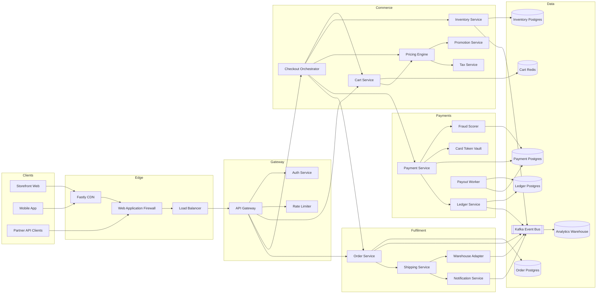
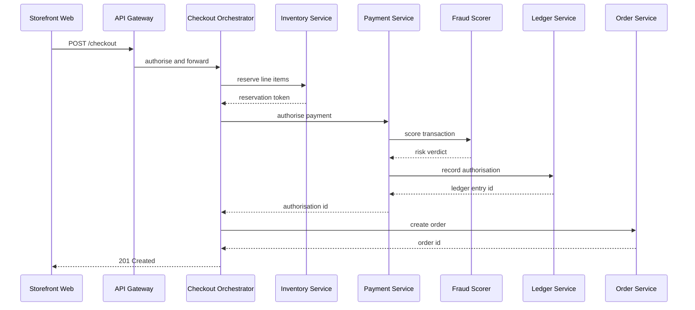
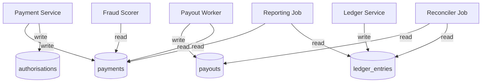
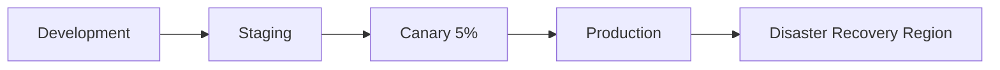

# Northwind Commerce — Platform Architecture

Reference architecture for the Northwind storefront. Every service boundary,
queue, and datastore that a checkout request can touch is catalogued here so
new engineers can trace a request end to end without reading the whole repo.

## Service Topology

The full request-serving surface. Edge traffic terminates at the CDN, is routed
by the API gateway, and fans out into the domain services.

## Checkout Request Flow

The happy path for `POST /checkout`. Payment authorisation is synchronous;
fulfilment is driven by events published after the order is durable.

## Payment Data Ownership

Which service is allowed to write which payment table. Only the Payment Service
and the Payout Worker hold write credentials for `payments`.

## Deployment Environments

